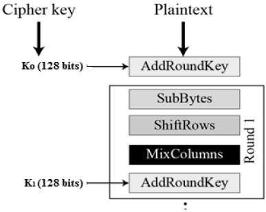

# Advanced Encryption Standard
The more popular and widely adopted symmetric encryption algorithm likely to be encountered nowadays is the Advanced Encryption Standard (AES). It is found at least six time faster than triple DES.

A replacement for DES was needed as its key size was too small. With increasing computing power, it was considered vulnerable against exhaustive key search attack. Triple DES was designed to overcome this drawback but it was found slow.

The features of AES are as follows:

-   Symmetric key symmetric block cipher
-   128-bit data, 128/192/256-bit keys
-   Stronger and faster than Triple-DES
-   Provide full specification and design details
-   Software implementable in C and Java

## Operation of AES

AES is an iterative rather than Feistel cipher. It is based on `substitution-permutation network`. It comprises of a series of linked operations, some of which involve replacing inputs by specific outputs (substitutions) and others involve shuffling bits around (permutations).

Interestingly, AES performs all its computations on bytes rather than bits. Hence, AES treats the 128 bits of a plaintext block as 16 bytes. These 16 bytes are arranged in four columns and four rows for processing as a matrix.

## Encryption Process

Here, we restrict to description of a typical round of AES encryption. Each round comprise of four sub-processes. The first round process is depicted below

## AES Analysis

In present day cryptography, AES is widely adopted and supported in both hardware and software. Till date, no practical cryptanalytic attacks against AES has been discovered. Additionally, AES has built-in flexibility of key length, which allows a degree of ‘future-proofing’ against progress in the ability to perform exhaustive key searches.

However, just as for DES, the AES security is assured only if it is correctly implemented and good key management is employed.
